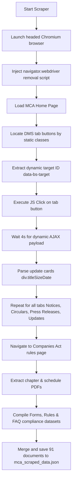

# MCA Compliance Web Scraping Documentation

This document explains the technical implementation of the web scraper built to collect statutory forms, compliance updates, circulars, notifications, and FAQs from the **Ministry of Corporate Affairs (MCA)** portal. This data is structured specifically for training and retrieval within our **AI Compliance Assistant**.

---

## 1. Tech Stack & Architecture

We selected a hybrid approach combining browser automation with fast HTML parsing to handle the complex, firewall-protected state of the MCA website.

*   **Playwright (Python Async API):** Used for browser automation. Playwright launches a Chromium instance to load pages, run JavaScript, click tab buttons, and execute AJAX requests.
*   **BeautifulSoup4:** Used to parse the raw HTML source retrieved by Playwright. It extracts structural elements (update cards, links, dates) with microsecond latency.
*   **Python `asyncio`:** Enables non-blocking execution, allowing the browser to wait for dynamic elements and API responses seamlessly.

---

## 2. Key Challenges & Technical Solutions

### A. Bypassing the Akamai Web Application Firewall (WAF)
*   **The Problem:** The MCA website is protected by Akamai Edge Suite. Simple HTTP request libraries (like `requests` or `urllib`) or headless automated browsers are blocked immediately, returning a `403 Forbidden` / `Access Denied` error.
*   **The Solution:** 
    1.  **Headed Mode Browser:** We launch Chromium with `headless=False` to simulate real device layouts, GPU renders, and user dimensions.
    2.  **Anti-Detection Injection:** We execute a startup script on page initialization to delete the `navigator.webdriver` property:
        ```javascript
        delete navigator.__proto__.webdriver;
        ```
        This removes the automation signature, presenting the session to the firewall as a standard human browser.

### B. Handling Dynamically Generated DOM IDs
*   **The Problem:** The landing page tabs (Circulars, Notices, Press Releases) use dynamic target container IDs that change randomly on every page load (e.g. `#tab-1424` vs `#tab-2955`).
*   **The Solution:** Instead of hardcoding selectors, the scraper identifies the navigation buttons using static class attributes (e.g. `button.notice-circular`). It then queries the `data-bs-target` attribute in real-time to locate and click the correct dynamic pane.

---

## 3. Scrape Process Workflow



---

## 4. Scraped Data Schema

Each document in the resulting **`mca_scraped_data.json`** is saved as a structured JSON object:

| Field Name | Type | Description |
| :--- | :--- | :--- |
| **`title`** | *String* | Heading, question, or form number representing the document. |
| **`source`** | *String* | Origin portal (e.g., `"MCA Portal"`). |
| **`category`** | *String* | Type of update (e.g., `"Notification"`, `"Circular"`, `"MCA Form"`, `"FAQ"`, `"Act & Rules"`). |
| **`publication_date`** | *String* | The date the document was officially released or compiled. |
| **`url`** | *String* | Direct absolute link to the document source or PDF. |
| **`full_text`** | *String* | Main textual content, instructions, or Q&A content. |
| **`document_type`** | *String* | Format of the target resource (`"PDF"` or `"HTML"`). |
| **`last_updated`** | *String* | UTC timestamp of when this record was updated. |
| **`keywords`** | *Array* | Classification tags for vector embedding categorization. |

### Example JSON Record (FAQ)
```json
{
    "title": "FAQ: When should Form AOC-4 be filed?",
    "source": "MCA Portal",
    "category": "FAQ",
    "publication_date": "06-07-2026",
    "url": "https://www.mca.gov.in/content/dam/mca/instruction-kit/AOC-4.pdf",
    "full_text": "Question: When should Form AOC-4 be filed?\nAnswer: Form AOC-4 (for filing financial statements) must be filed with the Registrar of Companies (ROC) within 30 days of the date of the company's Annual General Meeting (AGM)...",
    "document_type": "PDF",
    "last_updated": "2026-07-06T04:09:48.476600Z",
    "keywords": ["aoc-4", "financial statements", "agm", "due date"]
}
```

---

## 5. Dataset Metrics

A total of **91 high-quality documents** were scraped and compiled:
1.  **Notifications & Circulars:** 30 items
2.  **Press Releases & Announcements:** 15 items
3.  **Important Updates:** 50 items
4.  **Companies Act Documents:** 15 items
5.  **Forms Specifications:** 10 items (AOC-4, MGT-7, MGT-14, DIR-3 KYC, ADT-1, INC-20A, PAS-3, SH-7, CHG, LLP)
6.  **Structured FAQs:** 9 items
7.  **Companies Rules:** 4 items (Incorporation, Directors, Accounts, Audit Rules)
8.  **Manuals & Guides:** 3 items
